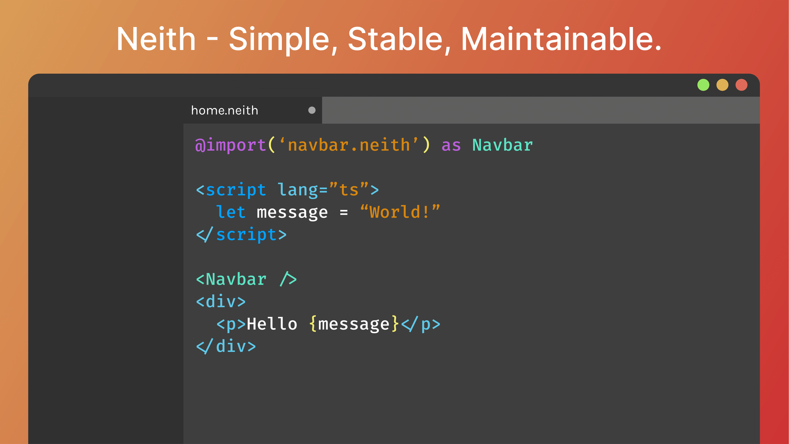

# Neith
A Deno-native frontend framework for making web development easier and enabling easy development of stable and maintainable web apps.

## Motivation

Although there are many web frameworks out there, they are mostly for Node.js and also mostly focus on one specific thing (for example Svelte with a compact and simple Syntax and dev experience; Angular with easier maintainability thanks to dependency injection.) With Neith I am trying to offer both a nice dev experience and easy maintainability at the same time, while also supporting new technologies like Deno.

This is currently a first prototype, which works in a very basic fashion, however improvements are in the works.

### Currently implemented:
 - Typescript in components
 - Custom components
 - Basic routing
 - handling props
 - handling CSS

### TODO:
 - SCSS support
 - implement @provide directive for dependency injection of services